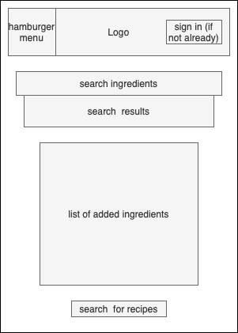
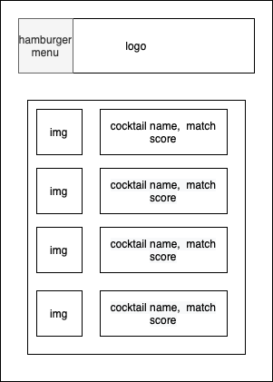
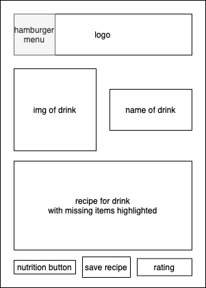
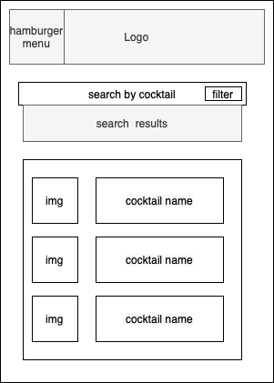
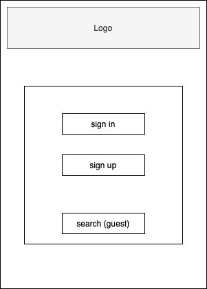

## User Experience Design

### App Prototype Link
Click [here](https://invis.io/MY10DOVS2HXZ) for the link to our prototype.

### App Map & Wireframe

#### BottomsUp Wireframe

     
      Entire wireframe displaying all possible user screens

#### BottomsUp App Map

     
      Entire app map displaying all possible user screens

#### Search Page

  
   Search page user sees when entering ingredients

     

#### Cocktail List

  
   List of possible cocktais based on available ingredients user has entered

     

#### Drink Page

  
   Recipe for specific drink user has selected

     

#### Search by Name Page

  
   Optional page to search for cocktails by their name

#### Sign-In Page

  
   Optional sign-in page to save recipes and ingredients entered

     
